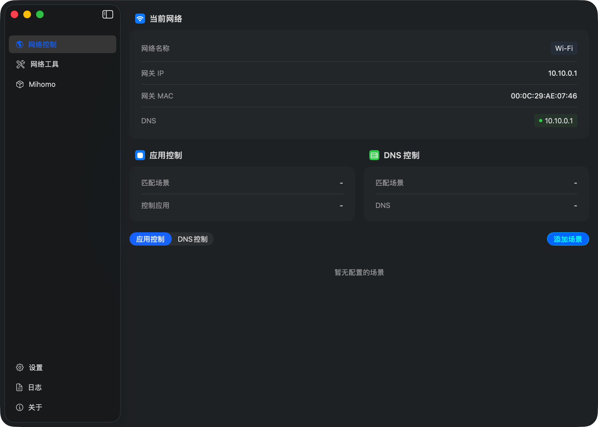
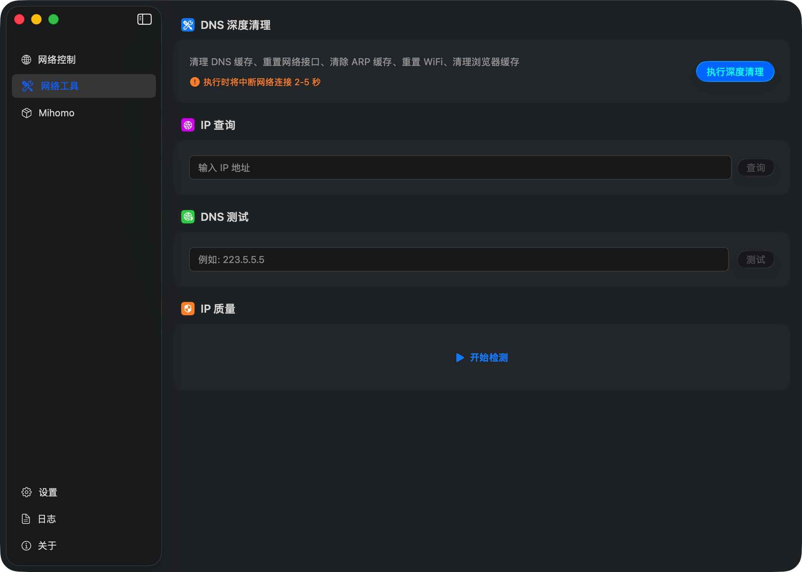
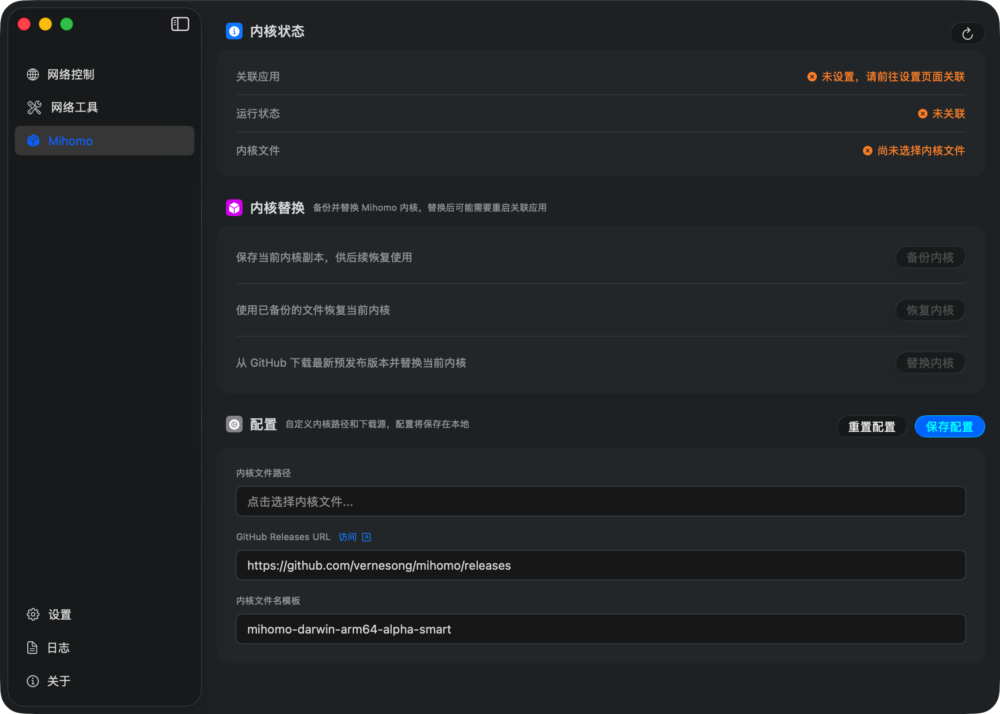

<div align="center">
  
  <h1>Kairos</h1>
</div>

<div align="center">
  <p>A native macOS menu-bar app for network scenes, DNS work, IP lookups, and Mihomo kernel maintenance.</p>
  <p>
    <a href="docs/README.zh-CN.md">简体中文</a> ·
    <a href="docs/README.zh-TW.md">繁體中文</a> ·
    <strong>English</strong> ·
    <a href="docs/README.ja.md">日本語</a> ·
    <a href="docs/README.ru.md">Русский</a>
  </p>
</div>

Kairos watches the active network and puts a few network tasks in one place. It is for people who regularly move between known networks and want predictable DNS or app actions, alongside IP and resolver tools.

## Network scenes

Kairos observes network-path changes and reads the default gateway's IP address and MAC address. A scene matches only when both values exactly match the enabled rule.

- An app-control scene can close its listed apps when the rule becomes active, then reopen apps that are no longer controlled after the scene changes.
- A DNS scene can apply its configured primary and optional secondary resolver to the current interface. It uses the privileged DNS Helper for this operation.
- A scene is not a proxy profile. Kairos does not create, edit, select, or apply proxy settings. Use your proxy client for that.

The matching values are visible in the app, so they can be copied into a rule for a network you trust.

## What is included

<table>
  <tr>
    <td width="32%">
      <strong>Network automation</strong><br><br>
      View active interfaces and the current gateway, then create separate app-control and DNS scenes for that gateway.
    </td>
    <td width="68%"></td>
  </tr>
  <tr>
    <td>
      <strong>Network tools</strong><br><br>
      Look up an IP, measure DNS response time over UDP, check public-IP characteristics, or run the guided deep-clean operation.
    </td>
    <td></td>
  </tr>
  <tr>
    <td>
      <strong>Mihomo kernel maintenance</strong><br><br>
      Associate your own client and kernel file, inspect its state, back it up, restore it, or download a matching kernel from GitHub Releases.
    </td>
    <td></td>
  </tr>
</table>

The deep-clean tool temporarily disconnects Wi-Fi while it clears DNS and ARP caches, resets the interface, clears Chrome and Firefox caches, and performs the final system cleanup. Expect a short interruption of roughly 2–5 seconds.

## DNS Helper and permissions

DNS changes and the deep-clean operation require Kairos's separately installed `SMAppService` LaunchDaemon. Register it in Settings, enter an administrator password when macOS asks, and approve it in System Settings if approval is required. The Helper can set or clear DNS servers, flush the DNS cache, and perform the privileged maintenance steps.

Accessibility permission is needed when an app-control scene must quit another app. Kairos can still monitor the network without it. Replacing a protected Mihomo kernel may also prompt for macOS file-operation authorization.

## Mihomo

Kairos does not include a Mihomo client or manage proxy rules. You choose the host app and its kernel file yourself. Kairos can back up and restore that file, or download the latest prerelease asset that matches the configured filename template from a GitHub Releases URL (the default is `vernesong/mihomo`). It asks you to quit the associated app before changing its kernel.

## IP data and API keys

An IP lookup entered in the app is sent to [ipapi.is](https://ipapi.is). The IP-quality check first discovers the public IP through `api64.ipify.org`, `checkip.amazonaws.com`, or `icanhazip.com`, then sends that IP to the sources below in parallel. A DNS benchmark sends the selected domain names directly to the resolver being tested.

| Source | Without a key | With your key |
|---|---|---|
| IPinfo, ipapi.is, DB-IP, IPWHOIS | Kairos uses their available free endpoint. | Kairos uses the provider's keyed endpoint when applicable; IPinfo's token endpoint is a fallback if its widget endpoint fails. |
| AbuseIPDB, IP2Location, ipregistry | Skipped. | Included in the IP-quality check. |

Configure keys in Settings only if you want the keyed sources or their higher limits. Kairos stores them in local `UserDefaults`; it does not provide its own relay service. A settings export (`.kairos`) includes API keys as well as scenes and Mihomo settings, so treat that file as sensitive and do not share it.

Provider responses are used to show location, ASN/organization, network type, and available privacy or abuse signals. Results can differ between providers and should not be treated as a security verdict.

## Install

### Homebrew

```bash
brew tap slippindylan/tap
brew trust --tap slippindylan/tap
brew install --cask kairos@beta
```

### DMG

The current public builds are beta releases. Download the latest DMG from [GitHub Releases](https://github.com/SlippinDylan/Kairos/releases), open it, and drag `Kairos.app` to `Applications`.

The release is signed with an Apple Development certificate but is not notarized by Apple. Apps downloaded from the internet receive macOS's quarantine attribute; Gatekeeper may therefore block the first launch. If you trust the release, remove that attribute after copying the app:

```bash
sudo xattr -rd com.apple.quarantine /Applications/Kairos.app
```

## Requirements and source build

- macOS 26.0 Tahoe or later
- Apple Silicon (arm64)

For a local build, use macOS 26 or later with Xcode 26 or later. Open `Kairos.xcodeproj`, choose your development team, update the reciprocal XPC code-signing requirements in `App/Services/DNSManager.swift` and `KairosHelper/main.swift` to use that team's identity, then build the `Kairos` scheme.

## License

Copyright © 2025–2026 SlippinDylan Studio. Kairos is licensed under the [Apache License 2.0](LICENSE).
